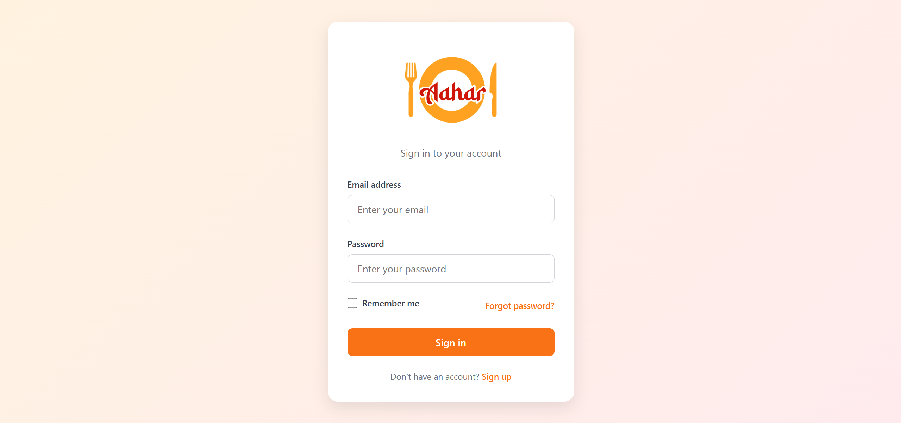
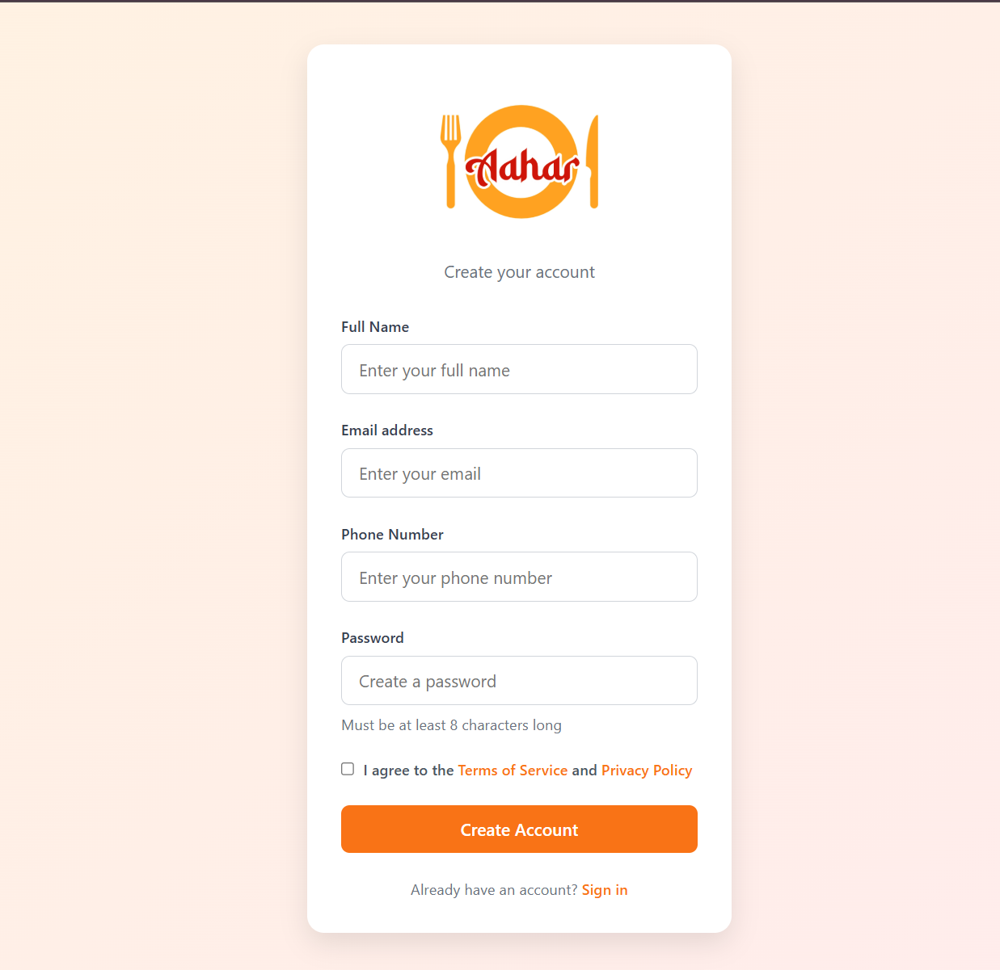
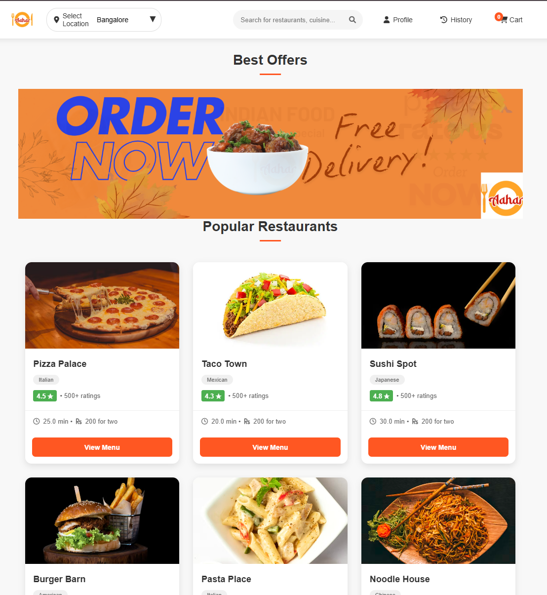
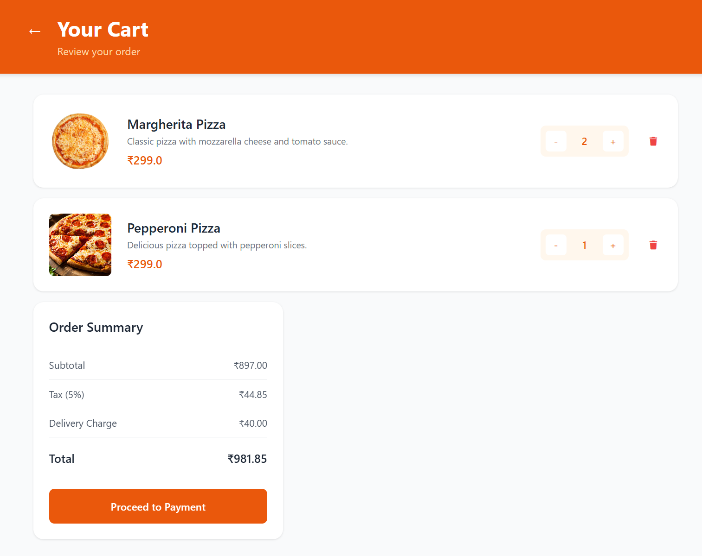
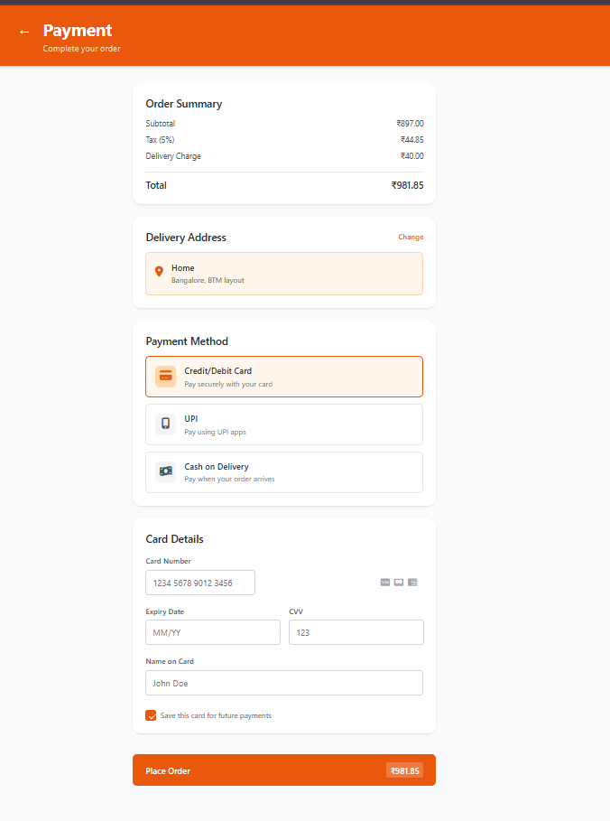
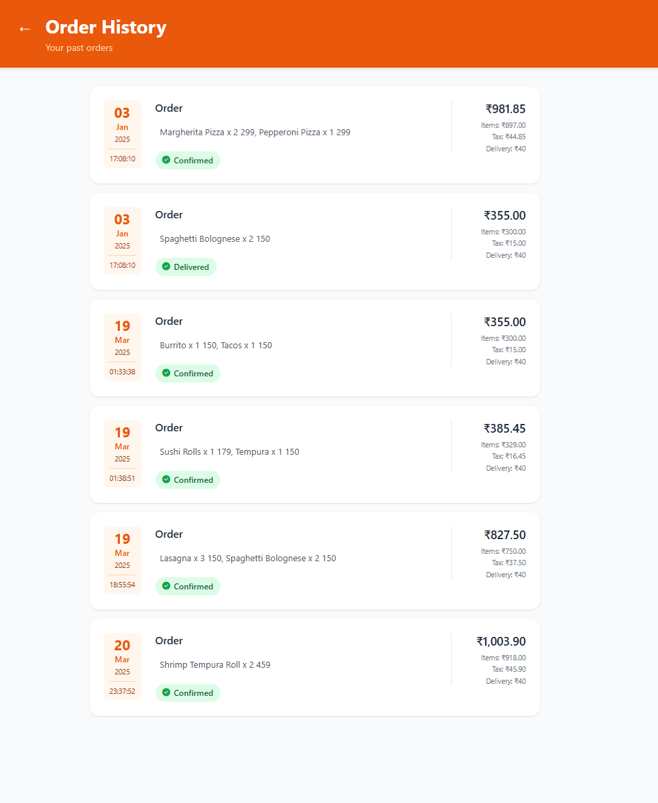

# 🍔 Aahar – Food Delivery Application

Aahar is a full-stack food delivery web application designed to provide a seamless online food ordering experience. Users can browse restaurants, view menus, place orders, and track their order history.

## 🔹 Features
- **User Authentication** – Secure login and registration using J2EE and Servlets.
- **Restaurant & Menu Browsing** – Fetches restaurant data dynamically from the database.
- **Order Management** – Users can place orders and view their order history.
- **Profile Management** – Users can update and manage their profile information.
- **Responsive UI** – Clean and user-friendly interface using HTML, CSS, and JavaScript.

## 🛠️ Tech Stack
- **Frontend:** HTML, CSS, JavaScript
- **Backend:** Java (J2EE, Servlets)
- **Database:** MySQL (JDBC for database connectivity)
- **Architecture:** DAO Design Pattern

## 🚀 Installation & Setup
1. Clone the repository:
   ```bash
   git clone https://github.com/SathishkumarMediga/AaharFoodExpress.git
   ```
2. Import the project into your IDE (Eclipse/IntelliJ).
3. Set up the MySQL database and update database credentials in the project.
4. Run the application using a Tomcat server.

## 📷 Screenshots 
  
  
  
  
  





## 📜 License
This project is available for viewing purposes only. No part of this code may be copied, modified, distributed, or used in any form without explicit written permission from the author.
See the full **[LICENSE](LICENSE)** file for more details.

